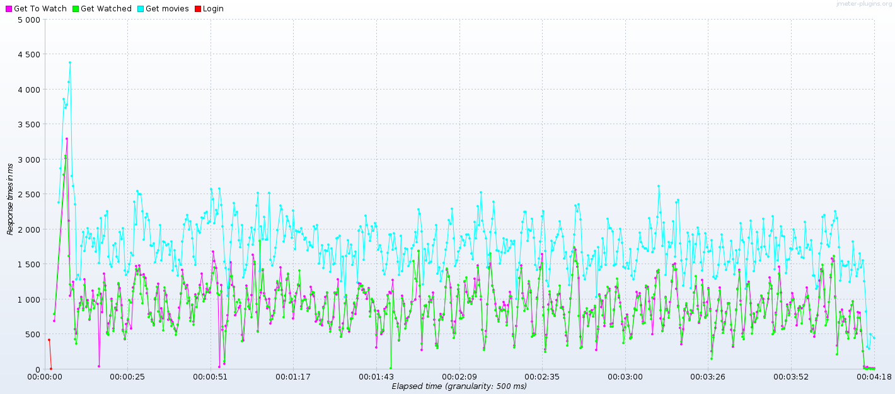
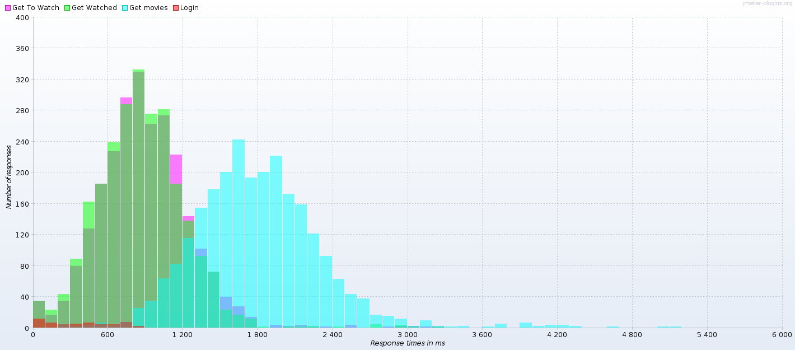
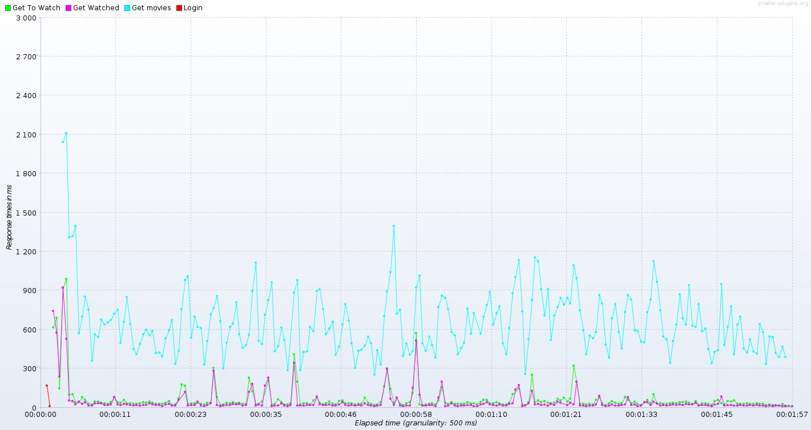
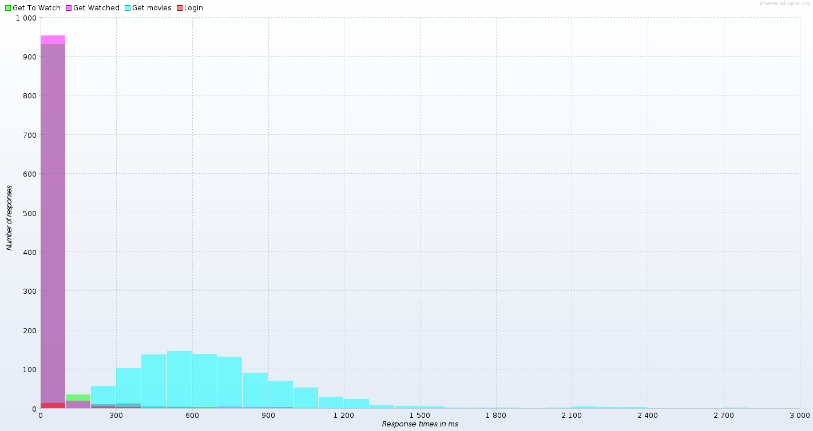

[Retour](../README.md)

# Test de montée en charge

Notre procédure de test est identique à celle du projet 1.
Nous avons choisi cette manière pour pouvoir avoir une base de comparaison.

Une modification majeure a été la récupération du JWT lors de l'authentification.
Pour ce faire, nous avons utilisé un `Regular Expression Extractor` pour extraire le token du header `Authorization` dans la variable `${auth}`.
Par la suite, les routes nécessitant ce token utilisera un `HTTP Header Manager` pour l'injecter dans le header `Authorization.

## Ronde de test

Une ronde de test correspond à une itération de test pour un thread.
Cela correspond, en d'autres termes, à une suite d'actions qu'un utilisateur pourrait être amené à faire lors d'une session.

Une ronde sera ensuite effectuée 50 fois afin d'encenser davantage la moyenne produite.

### Choix

Pour ce compte rendu, nous avons choisi d'utiliser une ronde de tests simpliste,
se contentant de se connecter à l'application (login), d'accéder (dans un ordre choisi aléatoirement à chaque ronde) à trois ressources.

À noter que le `login` n'est effectué qu'une seule fois, à la première itération, et que le `logout` n'est jamais effectué.
La raison à cela est que nous avons également effectué des tests disposant de caractéristiques plus réalistes à ce sujet, mais les résultats relatifs à ces requêtes étant absolument insignifiants, nous avons pris le parti de simplifier la ronde.

## 50 threads

Le premier test de charge que nous vous présentons représente 50 utilisateurs fictifs, effectuant chacun 50 rondes décrites ci-dessus, tout en attendant un délai aléatoire de l'ordre de la seconde avant de passer à la ronde suivante.

Le graphique ci-dessous représente les temps de réponse additionnés, par requête, moyennés par thread, sur toute la durée du test :



On voit dans un premier temps que les premiers appels prennent énormément de temps.
Cela est dû au chargement des objets spring pour répondre aux demandes.
Nous pouvons tous de même voir que la page `get movies` est clairement deux fois plus longue à calculer que les pages `get watched` et `get toWatch`.
Cela ne nous semble peu étonnant, car nous travaillons avec un ensemble de données bien plus grandes dans ce cas et ainsi que les informations ajoutées sont faites par une jointure très certainement lourde.

En comparaison avec le projet numéro 1, nous avons de claire amélioration avec des piques environ 4x plus bas en comparaison avec les 10 secondes visibles dans le rapport précédent.
Cependant, le serveur à de la peine à suivre avec une moyenne de réponse d'environ 2s pour `get movies` et environ 1s pour les pages `get watched` et `get toWatch`.
Il serait intéressant de fournir de la mise en cache pour certaines de ces données que nous n'avons pas mis en place dans les repository.

Sur le graphe suivant, nous pouvons plus facilement voir la répartition des temps de calcul des différentes pages :



## 20 threads

Le second test de charge effectué est passablement similaire au premier.
La première différence réside dans le nombre d'utilisateurs simultanés à effectuer des requêtes, qui passe donc de 50 a 20, dans le but de décharger un peu la machine de test.
On peut voir que le temps d'accès des pages `get watched` et `get toWatch` est devenu très raisonnable.



Cependant le temps d'accès à `get movies` reste conséquent, mais avec des temps de réponse acceptables.
Pour améliorer ces temps, il serait intéressant de faire du caching.

Sur le graphe suivant, nous pouvons plus facilement voir la répartition des temps de calcul des différentes pages :



## Remarque générale

Les remarques sont très proches de celle du premier projet c'est-à-dire :

```text
Si ces tests ont été très intéressants à mettre en place, ils ne s'avèrent pas très intéressants à effectuer sur une machine de type laptop.
Ceci pour la simple raison que les performances disponibles varient passablement sur la durée, et que le matériel n'est en aucun point optimisé pour ce genre de tâche.

Il est donc difficile d'accorder beaucoup de légitimité aux tests de charge dans un tel contexte, même si, encore une fois, l'élaboration d'une stratégie permettant de représenter un certain cas d'utilisation d'une application est aussi importante que ludique.
Cela aide également à la compréhension des défis majeurs rencontrés par une telle application en production.
```

Mais à cela s'ajoute l'aspect de caching pouvant être intéressant dans ce cas, car il est facilement implémentable dans hibernate en ajoutant des consignes de caching dans les repository.

[Retour](../README.md)